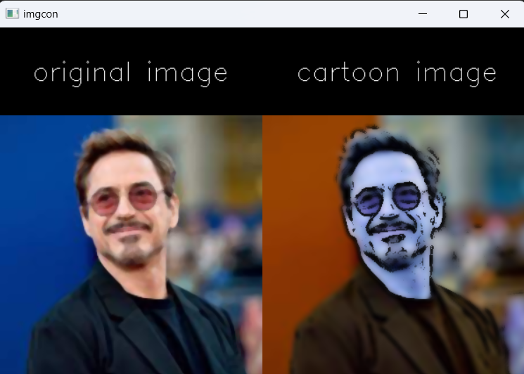

# Cartoonify-Image-OpenCV

This project uses OpenCV to transform an image into a cartoon-like version. It does this by applying various image processing techniques such as blurring, edge detection, and color quantization.

## Installation

To use this project, you'll need to have OpenCV and NumPy installed. You can install them using pip:

pip install opencv-python

pip install numpy

You'll also need to download the `Cartoonify-Image-OpenCV.ipynb` file from the GitHub repository. You can do this by clicking on the "Code" button on the repository page and selecting "Download ZIP". Once you've downloaded and unzipped the file, you can open it in a Jupyter notebook.

## Usage

To use this project, simply run the `Cartoonify-Image-OpenCV.ipynb` file in a Jupyter notebook. You can then upload an image and see the cartoonified version.

The code applies various image processing techniques to the uploaded image to create a cartoon-like version. These techniques include blurring, edge detection, and color quantization.

Here's a detailed explanation of how the code works:

1. The code starts by importing the necessary libraries: `cv2`, `urllib`, and `numpy`.
2. It then reads an image from a URL using `urllib.request.urlopen()` and converts it into a NumPy array using `np.asarray()`.
3. The image is then decoded using `cv2.imdecode()` and displayed using `cv2.imshow()`.
4. The image is resized to 300x300 pixels using `cv2.resize()`.
5. A median blur is applied to the image using `cv2.medianBlur()`.
6. The image is converted to RGB and grayscale using `cv2.cvtColor()`.
7. An adaptive threshold is applied to the grayscale image using `cv2.adaptiveThreshold()`.
8. A bitwise AND operation is performed between the RGB image and itself using `cv2.bitwise_and()`, with the thresholded grayscale image as a mask.
9. A bilateral filter is applied to the resulting image using `cv2.bilateralFilter()`.
10. A black image is created using `np.zeros()` and concatenated with the original image using `np.concatenate()`.
11. Text is added to the concatenated image using `cv2.putText()`.
12. The same process is repeated for the cartoonified image.
13. The two concatenated images are then concatenated together and displayed.

